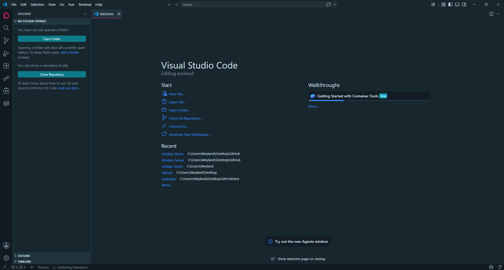
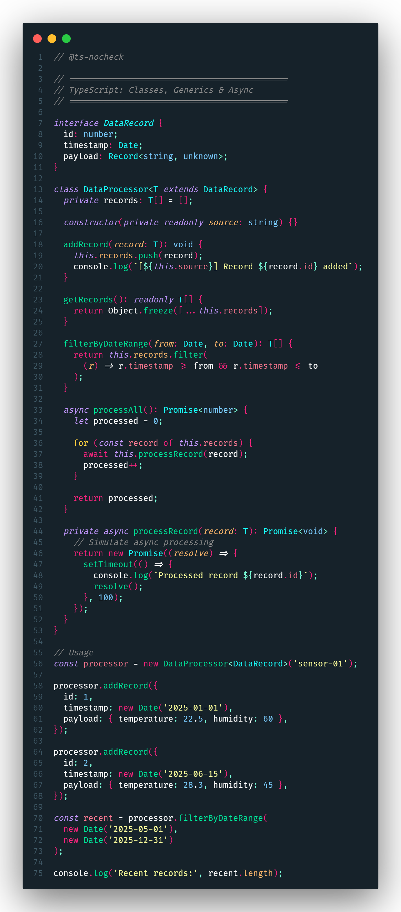
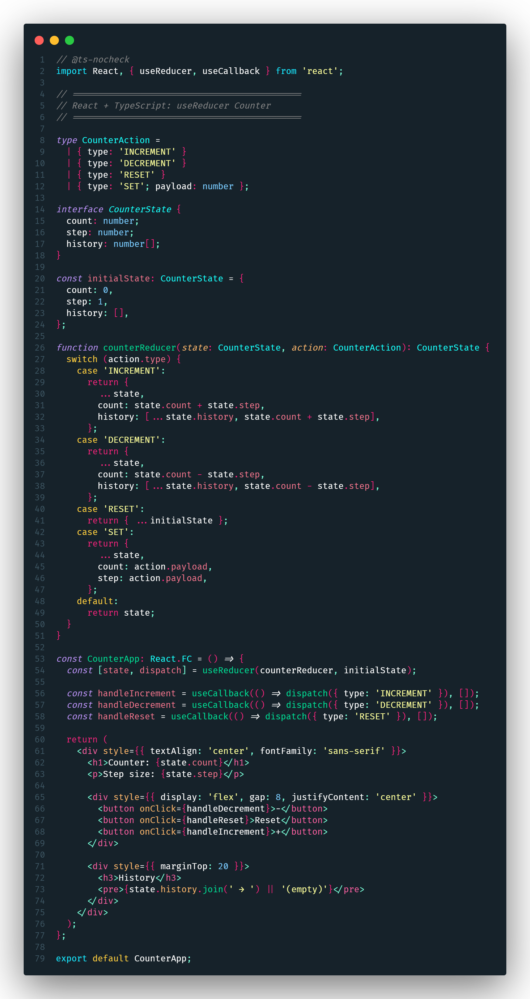
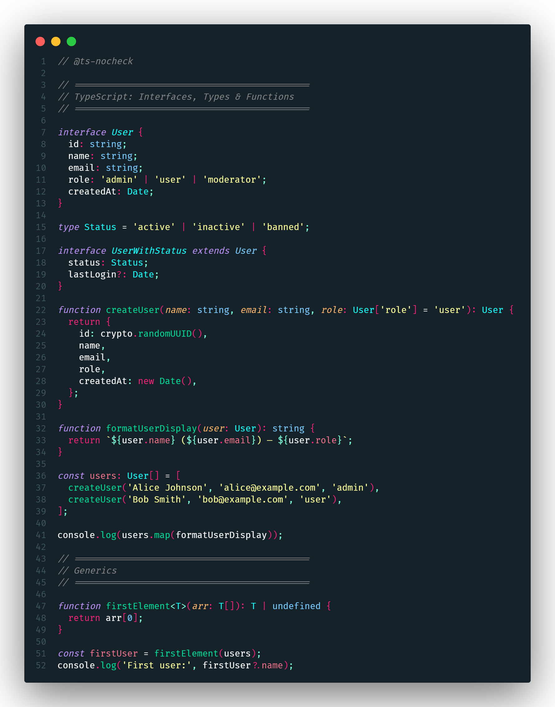
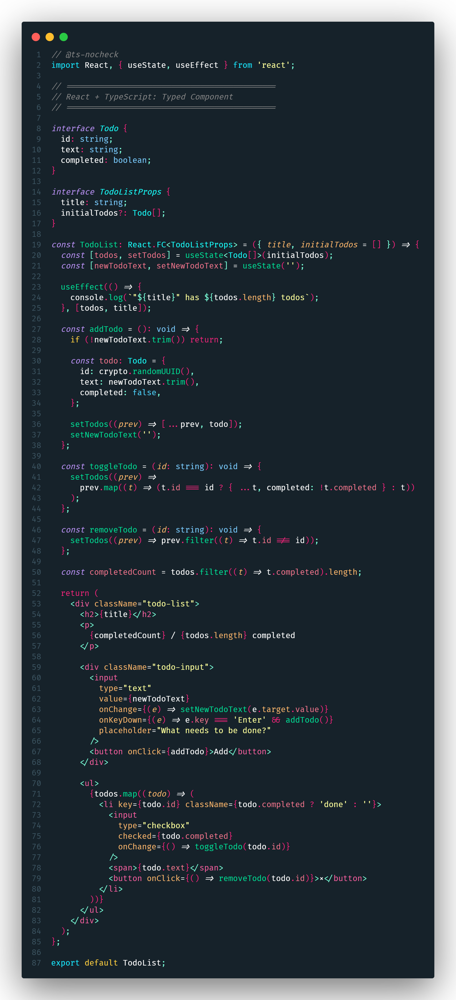
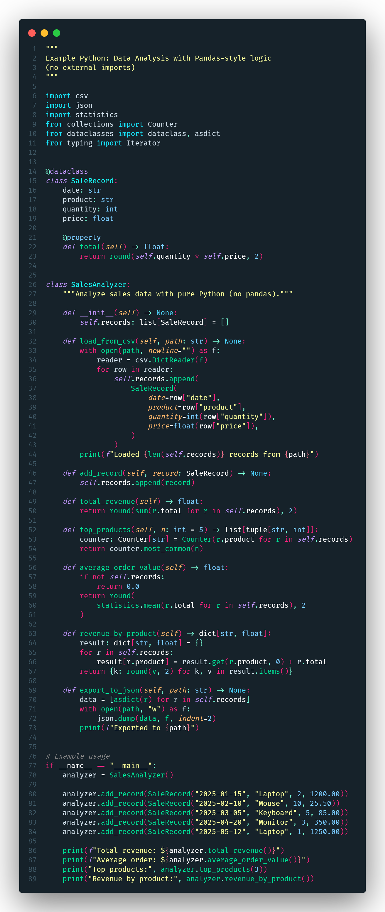
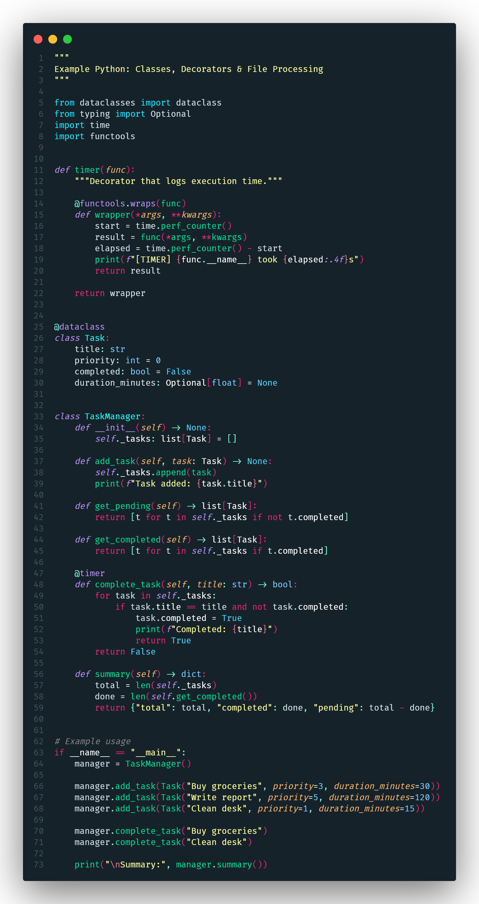

<h1 align="center">
  Weyland Viridian Storm <code>🗲</code> <br>
  
</h1>

<p align="center">
  <em>⚡ Dark teal depths meet neon violets, hot pinks, and acid yellows — built for those who code in the eye of the storm.</em>
</p>

<p align="center">
  
  
  
  
</p>

<p align="center">
  
  
  
  
  
  
  
  
</p>

---

A dark **Visual Studio Code** theme inspired by **Tokyo Night Storm** and **Dracula**. Deep teal backgrounds combined with vibrant neon accents — purple, hot pink, and acid yellow.

---

## ✨ Why Weyland Viridian Storm?

| Feature                      | Description                                                                                                                                                    |
| ---------------------------- | -------------------------------------------------------------------------------------------------------------------------------------------------------------- |
| 🌈 **Colorful Syntax**       | ✨ TypeScript, JavaScript, React, Python, HTML, CSS, SCSS, `.env` — each language gets its own distinct neon palette. Code becomes visual hierarchy.           |
| 🔲 **Rainbow Brackets**      | Brackets are color-coded in multiple neon hues with matching pair guides — never lose track of nesting.                                                        |
| 🔥 **Hot Pink Line Numbers** | The active line number glows in hot pink so you always know where you are.                                                                                     |
| 📄 **.env Support**          | `.env` files get full syntax highlighting — variables, strings, numbers, booleans, comments, and export keywords all styled out of the box.                    |
| 🖥️ **Beautiful UI**          | Every part of VS Code is themed — tabs, activity bar, side bar, status bar, panel, terminal, minimap, scrollbar, menus, dropdowns, buttons. From edge to edge. |
| 🌙 **Eye-Friendly**          | Deep teal background (`#16222a`) reduces eye strain during long coding sessions.                                                                               |

---

## 🎨 Color Palette

| Element            | Color                 | Hex                               |
| ------------------ | --------------------- | --------------------------------- |
| Editor Background  | Dark Teal             | `#16222a`                         |
| Foreground         | Light Blue            | `#d1e0eb`                         |
| Line Highlight     | Dark Blue             | `#1e3039`                         |
| Cursor             | Light Blue            | `#d1e0eb`                         |
| Selection          | Blue                  | `#267ead55`                       |
| Line Numbers       | Gray                  | `#3e5764`                         |
| Active Line Number | **Hot Pink** 🔥       | `#ff247f`                         |
| Brackets           | Orange / Cyan / Green | `#FF5A00` / `#00E1FF` / `#10FF00` |
| Errors             | Red                   | `#ff2f2f`                         |
| Warnings           | Yellow                | `#ffdd00`                         |

---

## 📦 Installation

```bash
# VS Code Marketplace → Ctrl+Shift+X → search "Weyland Viridian Storm" → Install
# Or run:
code --install-extension yuriweyland.weyland-viridian-storm
```

Then open Command Palette (`Ctrl+Shift+P`) → `Preferences: Color Theme` → select **Weyland Viridian Storm**.

---

## 📸 Screenshots

<table>
  <tr>
    <td><strong>🔷 TypeScript: Classes, Generics & Async</strong></td>
    <td><strong>⚛️ React + TypeScript: useReducer Counter</strong></td>
  </tr>
  <tr>
    <td></td>
    <td></td>
  </tr>
  <tr>
    <td><strong>🔷 TypeScript: Interfaces, Types & Functions</strong></td>
    <td><strong>⚛️ React + TypeScript: Typed Component</strong></td>
  </tr>
  <tr>
    <td></td>
    <td></td>
  </tr>
  <tr>
    <td><strong>🐍 Python: Data Analysis (pandas-style)</strong></td>
    <td><strong>🐍 Python: Classes, Decorators & File Processing</strong></td>
  </tr>
  <tr>
    <td></td>
    <td></td>
  </tr>
</table>

---

## 📄 License

MIT © [Yuri Chehorynskyi](https://github.com/Weyland-Yuri)
